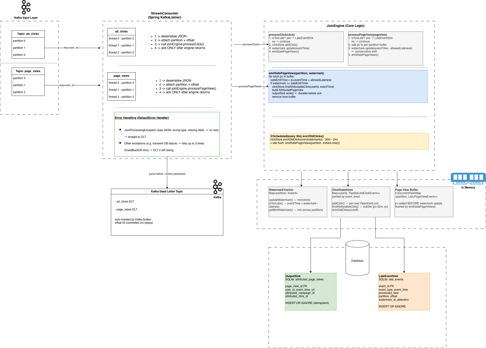

# Design Decisions

## Architecture

```
Kafka (ad_clicks, page_views)
  → StreamConsumer (@KafkaListener, one thread per partition)
      → JoinEngine.processClick() or .processPageView()
          → WatermarkTracker  — drop late events, advance watermark
          → ClickStateStore   — store/query clicks per user
          → OutputSink        — write attributed result to SQLite
          → LateEventSink     — write late events to SQLite
          → acknowledgment.acknowledge() — commit offset AFTER durable write
          
      → Errored events → DefaultErrorHandler → DLT topic
  JoinEngine @Scheduled(30s): evictOldClicks()
```


## Component Flow



---

## Offset Commit Sequence (at-least-once guarantee)

```
  Kafka delivers record
        │
        ▼
  JoinEngine processes (state updated, pv buffered)
        │
        ▼
  emitSafePageViews() → OutputSink.write() ← durable to SQLite
        │
        ▼
  acknowledgment.acknowledge() ← offset committed
        │
        ▼
  CRASH HERE? → restart replays from last committed offset
               → INSERT OR IGNORE skips already-written rows
```

On restart, watermark and page-view buffer are both lost (in-memory only). Kafka replays
all unacknowledged events from the last committed offset, rebuilding both from scratch.

---

## Key Design Decisions

| Concern | Decision | Reason |
|---|---|---|
| Offset commit timing | After `OutputSink.write()` returns | Guarantees at-least-once; no lost outputs on crash |
| Idempotent output | `page_view_id` PRIMARY KEY + `INSERT OR IGNORE` | Safe to replay; dedup at sink |
| Page view emit timing | Buffer until `watermark >= pv.eventTime + allowedLateness` | Prevents emitting with null attribution when the matching click hasn't arrived yet |
| Concurrency model | One thread per Kafka partition | Preserves per-partition ordering without explicit ordering locks |
| State locking | Per-user `ReentrantLock` in `ClickStateStore` | Fine-grained; avoids global lock bottleneck |
| Watermark direction | Monotonically increasing per partition | Prevents re-opening closed windows |
| Watermark contribution by event type | Clicks: `eventTime`; page views: `eventTime - allowedLateness` | See watermark design note below |
| State eviction cutoff | `min(all watermarks) - 30min - allowedLateness` | Bounded memory; safe to evict only what can never be attributed |
| Late event handling | Drop + write to `late_events` via `LateEventSink` | Explicit audit trail; beyond `allowedLateness` window |
| SQLite WAL mode | `PRAGMA journal_mode=WAL` on both sinks | Allows Grafana to read concurrently without "database is locked" errors |

---

## Watermark Design Note

### Problem

Using a single watermark that advances to `event.eventTime` for all event types creates a
conflict between two scenarios:

(Note: I am referring to the scenarios in `docs/SCENARIOS.md`)

- **Scenario 2 (out-of-order click):** pv_2 arrives at 12:15 before its click (12:12).
  If pv_2 advances the watermark to 12:15, cutoff becomes 12:13, and click_2 at 12:12
  is rejected as late — wrong attribution.

- **Scenario 5 (late click):** click_5 has event_time 12:40 but arrives at processing
  time 12:50, after pv_5 (12:45). If page views don't advance the watermark, the watermark
  is still 12:35 (from click_4), cutoff is 12:33, and click_5 at 12:40 is accepted —
  breaking the late-event drop requirement.

### Chosen approach: conservative page view watermark contribution

Page views contribute `eventTime - allowedLateness` to the single shared watermark instead
of `eventTime`. This shifts the page view's contribution back by exactly the lateness
window, which is the maximum gap a legitimate out-of-order click can arrive in.

**Watermark update formula:**

```
clicks:     watermark = max(current, click.eventTime)
page views: watermark = max(current, pv.eventTime - allowedLateness)
```

The `max(current, ...)` monotonic guarantee lives in `WatermarkTracker.updateWatermark()`.
The shift is applied at the call site in `JoinEngine.processPageView()`:

```java
// clicks
watermarkTracker.updateWatermark(partition, eventTime);

// page views
Instant conservativeWatermark = eventTime.minus(watermarkTracker.getAllowedLateness());
watermarkTracker.updateWatermark(partition, conservativeWatermark);
```

Effect on the two problem scenarios:

```
pv_2 at 12:15 → contributes max(current, 12:13) to watermark  → cutoff 12:11
click_2 at 12:12 → 12:12 > 12:11 → NOT late ✅

pv_5 at 12:45 → contributes max(current, 12:43) to watermark  → cutoff 12:41
click_5 at 12:40 → 12:40 < 12:41 → late, dropped ✅
```

### Alternative considered: per-event-type watermarks

I considered maintaining separate watermark maps keyed by `"event_type#partition"` —
one for `ad_click`, one for `page_view`. Clicks check and advance the click watermark;
page views check and advance the page_view watermark; the buffer flushes using the click
watermark only.

This correctly protects click_2 but breaks scenario 5: with no click arriving between
click_4 (12:35) and click_5 (12:40, arrives at 12:50), the click watermark never reaches
12:42, so click_5 is not rejected as late.

---


## Manual Acknowledgment 

`KafkaConsumerConfig` sets `AckMode.MANUAL` and `ENABLE_AUTO_COMMIT=false`:

```
Default (auto-commit):          This project:
  receive record                  receive record
  auto-commit offset ← too early  process it
  process it                       write to SQLite
  crash → record LOST ❌           acknowledge() ← safe
                                   crash → replay from last ack ✅
```

We manually acknowledge only after the output is durably written to SQLite, ensuring that if the application crashes 
before acknowledgment, the unacknowledged records will be reprocessed on restart. The idempotent sink will prevent 
duplicate outputs.

---

## Scheduled Eviction
Flushing for stale events stuck in buffer. `@EnableScheduling` activates Spring's task scheduler. `JoinEngine` runs eviction every
30 seconds in a background thread, independent of Kafka processing:

```java
@Scheduled(fixedRate = 30000)
public void evictOldClicks()
```

Eviction cutoff: `min(all partition watermarks) - attributionWindow - allowedLateness`.
This ensures no click that could still be attributed to a buffered page view is removed.

I have extended it to also flush buffered page views using wall-clock time as a stand-in watermark when no real events are arriving.
The rule is: `if Instant.now() >= pv.eventTime + allowedLateness`, it's safe to emit — the real world has moved past the 
lateness window even if no Kafka event has arrived.

## Metrics

We are using [Micrometer](https://www.baeldung.com/micrometer) to track and expose application metrics. 

These are scraped by Prometheus and visualised in Grafana dashboards. 
For example, we have counters for total processed events, late events, and a gauge for the current watermark per partition. 
This allows us to monitor the application's health and behaviour in real-time.

